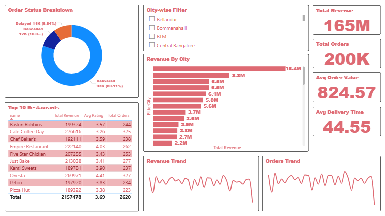
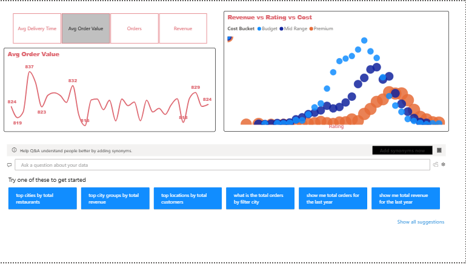
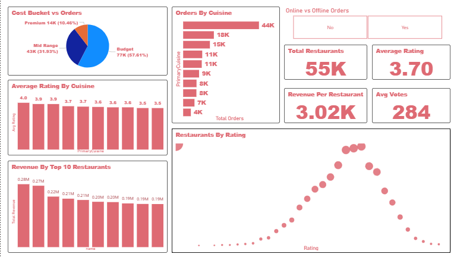

# ZOMATO Analytics Dashboard - Power BI Project

---

## Overview

This project is an interactive **Food Delivery Analytics Dashboard** built using **Power BI** to analyze restaurant performance, customer behavior, delivery efficiency, and revenue trends.

The dashboard provides valuable insights into:

- Employee attrition patterns
- Revenue performance
- Order trends
- Customer retention
- Delivery efficiency
- Restaurant ratings and performance
- Cancellation trends
- Time-based sales analysis

---

## Tools & Technologies

- Power BI
- Power Query
- DAX
- Excel / CSV Dataset

---

## Features

- Interactive dashboard
- KPI cards
- Dynamic slicers and filters
- Revenue analysis
- Customer analytics
- Restaurant performance tracking
- Time intelligence analysis
- Dynamic KPI selection
- Advanced DAX calculations
- Data cleaning and transformation

---

## Dashboard Pages

### Page 1 – Executive Overview

- Total Revenue
- Total Orders
- Total Customers
- KPI summary cards

### Page 2 – Customer Analytics

- Repeat customers
- Orders per customer
- Customer behavior insights

### Page 3 – Restaurant Performance

- Revenue by restaurant
- Ratings analysis
- Restaurant comparison

### Page 4 – Delivery Insights

- Delivery time analysis
- Late delivery percentage
- Cancellation trends

### Page 5 – Time Intelligence

- Revenue YTD
- Revenue Growth %
- Monthly performance trends

---

## Project Workflow

- Import dataset
- Inspect columns
- Clean and transform data in Power Query
- Create RestaurantID
- Create Restaurants table
- Create Orders table
- Create Customers table
- Create Date table
- Build relationships
- Create calculated columns
- Create base measures
- Create advanced measures
- Build dashboard pages
- Add slicers and interactions
- Final formatting and optimization

---

## DAX Measures & Calculated Columns

The project includes:

- Calculated columns
- KPI measures
- Customer analytics measures
- Time intelligence measures
- Revenue growth calculations
- Dynamic KPI switching

---

## Files Included

- **Food-Delivery-Analytics.pbix** → Power BI dashboard
- **dataset.xlsx / csv** → Dataset
- **dashboard-preview.png** → Dashboard screenshot
- **DAX_Measures.txt** → DAX calculations and measures
- **README.md** → Project documentation

---

## Learning Outcomes

- Data cleaning using Power Query
- Data modeling in Power BI
- Relationship building
- DAX calculations
- Time intelligence functions
- Dashboard design principles
- Business KPI analysis
- Interactive reporting

---

## Dashboard Preview

---

## Author

### Dheer Limbad